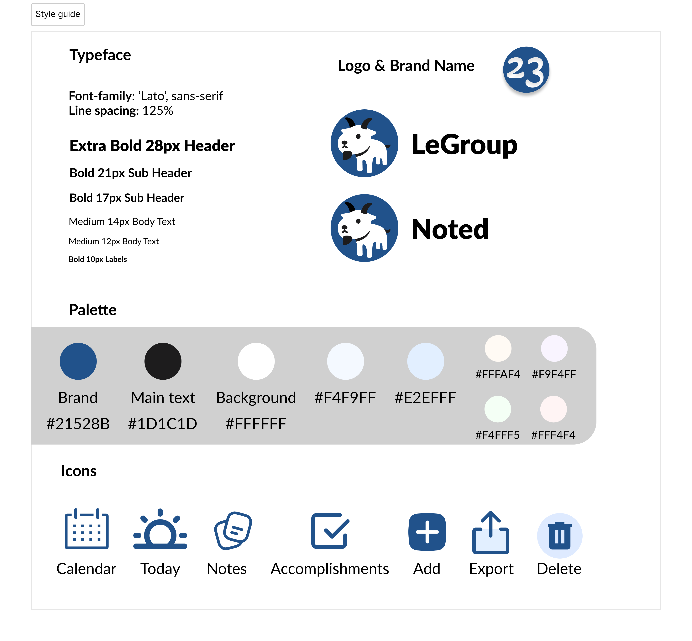

# Style Guide ADR

## Context

Branding, colors, typography, and logos are all essential for conveying an identity to users. As a work documentation app, Noted should be catered towards professionals that want to keep a daily log of their accomplishments and more. Functionality and aesthetics should be simple and effective, leaving little to no room for user confusion. Branding should be both reflective of the app itself as well as the team.

## Goat Logo & Branding

A goat was chosen for our logo in order to reflect our team branding. We are team 23 of CSE 110, and decided to name our group "LeGroup" after Lebron James because he wears the number 23 on his jersey. Rather than choosing to use an image of Lebron as our logo, we decided to use a goat, as many refer to Lebron James as the GOAT, or Greatest of All Time. The colors of the goat were stylized according to our brand colors, and we wanted the goat to appear friendly and simple, much like our web app.

## Colors

Dark blue, black, and white were chosen to be the colors due to its professional tone and clean, minimalistic feel. In the case of our website, we did not want the aesthetics of the site to distract from its utility and usability, but rather to complemement it. By keeping the branding colors simpler, we can allow for more diversity of color within the objects of the site itself, such as notes, or calendar days. Note colors were chosen to be pastel colors to ensure readability of the text overlay, as well as distinguishability between notes.

## Typography

The sans-serif font "Lato" was chosen to represent both the fonts for the headers and body text of the web application. First and foremost, sans-serif fonts provide more readability on screens due to the clean lines and lack of decorative elements. It also because of this that sans-serif fonts tend to scale better with various screen sizes and resolutions. Additionally, the clean, minimalist design of the sans-serif font "Lato" conveys a modern and professional look, which complements our brand identity. As stated earlier, the fact that our font can be used as both headers and body text is a strength of the versatility of sans-serif fonts. Lastly, importing custom fonts could introduce dependency on a third party or can introduce further load times for the user, which would be unneccessary.

## Logos & Icons

Logos and icons were compressed into svg file formats to optimize image file sizes, which helps our performance. As stated with the typography, minimalism, readability, and accessibility were the main rules that we wanted to follow when making our logos. Universally recognized symbols should be used to represent its associated object. Thick lines should also be used to ensure readability and reduce complexity of the icon. As more icons/logos are produced, they should be able to say "Yes" to the following questions:

1. Can its associated tool/object be easily understood from the icon/logo?
2. Does the icon/logo contain as little lines and points as possible?
3. Does the icon/logo fit with the existing icons and logos? (i.e. There should be no sharp edges)
4. Is the icon/logo compressed into a file format that is most appropriate?
5. Does the icon/logo follow the color palette of the style guide?

## More Decisions and Reasonings

A **high-contrast mode** and a **dark mode** were considered to be add-ons for Noted.

A high-contrast mode would improve accessibility, improving readability for users with visual impairments, such as low vision or color blindness. This mode would make it easier to distinguish between text and background.

A dark mode would help reduce the amount of blue light emitted by screens, which would minimize eye strain in low-light environments, making extended usage of Noted more comfortable. Users may also simply opt for dark mode due to its moder, sleek aesthetic appeal and comfort.

Due to the iron triangle constraint of time, our group opted not to create these two modes, as implementing different styles across our whole application would take considerable time and lower the quality of our main, dominant style. These two options will be reconsidered at a later date when essential features have been created and tested.
